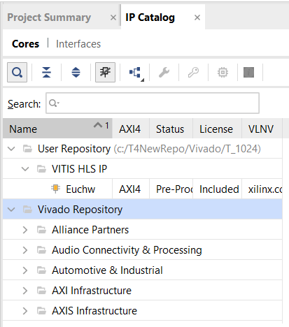
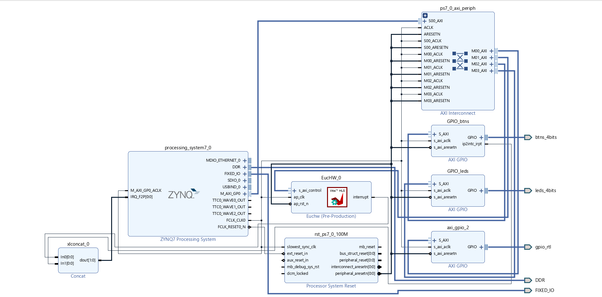

# SISTEMA HETEROGÉNEO  EN SOC ZYNQ
----


## Tabla de contenidos
- [# SISTEMA HETEROGÉNEO  EN SOC ZYNQ](#-SISTEMA-HETEROGÉNEO-EN-SOC-ZYNQ)
- [Tabla de contenidos](#tabla-de-contenidos)
  - [Descripción](#descripción)
  - [Requisitos](#requisitos)
  - [Números enteros](#Números-enteros)
      - [Vitis HLS](#Vitis-HLS)
      - [Vivado](#Vivado)
      - [Xilinx Vitis](#Xilinx-Vitis)
  - [Resultados para la versión de números enteros](#Resultados-para-la-versión-de-números-enteros)
  - [Números flotantes](#Números-flotantes)
  
      - [Vitis HLS](#Vitis-HLS2)
      - [Vivado](#Vivado2)
      - [Xilinx Vitis](#Xilinx-Vitis2)
  - [Resultados para la versión de números flotantes](#Resultados-para-la-versión-de-números-enteros)	 
  - [Tabla de comparación de ambas versiones](#Tabla-de-comparación-de-ambas-versiones)	 
	  - [Informacion de contacto](#informacion-de-contacto)

### Descripción

Este repositorio es un tutorial para  la implementación de un co-procesador en la plataforma de desarrollo Zynq^{TM} - 7000 de la Tarea 4, asignatura IPD432 (Diseño avazanzado de sistemas digitales).	Se diseña en  FPGA el cálculo de la distancia Euclidiana entre dos vectores con High-Level-Synthesis (HLS). El procesador ARM de la Zynq-7000  cumple el rol de host que solicita el servicio
de procesamiento de vectores a un co-procesador especializado implementado en la FPGA (Programmable Logic o PL). El PS y el PL se comunican mediante un bus AXI4-Lite. El host  envía los datos al PL,  y recibe el resultado. Todas las tareas de procesamiento se implementan en el SoC, mientras que el computador externo se utiliza para configurar, depurar, y monitorear el PSa través de el protocolo de momunicación UART. La  configuración emplaeada para el PS es bare-metal.
Se presentan dos versiones del cálculo de la distancia Euclidiana,  se diseña un co-procesador paran números enteros  de 32 bits, y se modifica el diseño para otra versión de co-procesador para operar con números flotantes de precisión simple. Además,  se muestra la latencia obtenida de cada versión  desde el momento en que el procesador comienza a enviar los datos hasta que tiene el resultado final.

### Requisitos

Para reproducir los resultados obtenidos se requiere instalar los siguientes programas:
- Vitis HLS: Herramienta de síntesis de alto nivel que permite mediante funciones en C y C++ desarrollar bloques IP en RTL  para diseños de hardware en Vivado. 

- Vivado: Paquete de software  para la síntesis,  análisis  e implementación de diseños de lenguaje de descripción de hardware (HDL).

- Xilinx Vitis: Permite la programación del procesador y la importación del hardware diseñado para la lógica programable desde Vivado. En el caso de interés para la plataforma de desarrollo  Zynq^{TM} - 7000.

- Python: Para configurar, depurar, y monitorear el PS.

- NUMPY library: Permite generar los vectores en la PC, calcular resultado esperado y la estadística de la latencia obtenida

- pySerial: Para la comunicación serial entre la PC y la Zybo.

La versión de Xilinx Vitis, Vitis HLS y Vivado empleadas en este trabajo son del 2021.1.

IMPORTANTE: Es posible que hasta la fecha Vitis HLS tenga problemas para exportar a Bloque IP debido a un problema denominado "New Year's bug". Para solucionarlo, se deben seguir los pasos estipulados [aquí](https://support.xilinx.com/s/article/76960?language=en_US).


 Clonar el repositorio a un directorio. Se recomienda que la dirección del directorio  sea corta  para evitar conflictos con los programas mencionados.

```
git clone https://github.com/ReyPowerLab/T4_SoC-Zynq
```
### Números enteros

### Vitis HLS 

Crear un projecto en Vitis:

Se inicia Vitis HLS y se selecciona la opción Create Project, se le asigna un nombre  y el directorio de localización del proyecto

<center></center>
      <center>This is an image</center>

Luego, en la ventana siguiente se agregan los códigos fuentes en C disponibles en repositorio: T4_SoC_int/Vitis HLS Codes/:

- EucHW.cpp
- EucHW.h
- specs

Luego se especifica el código principal y dar siguiente. En la ventana a continuación se agregan los códigos de simulación:

- EucSW.cpp
- EucSW.h
- EucTB.cpp

A continuación, se selecciona el período de 14.28 ns y la plataforma de desarrollo:


<center></center>
      <center></center>

Con los pasos previos se tiene el proyecto creado. Luego, en el fichero specs,  definir el tipo de variables T y T2 como int para indicar que el diseño opera con números enteros. Además, indicar el valor de M con 1024. Los siguientes pasos son de simulación, síntesis y exportación a RTL. Estas opciones se encuentran en el ménú desplegable en el ícono verde de la barra de herramientas que se muestra en la figura. Además, se muestran cinco resultados de simulación. Si se desea verificar un número mayor de veces los resultados de simulación, en el archivo EucTB.cpp se puede introducir a la variable test el número de simulación deseado.


<center></center>
      <center></center>

A continuación se muestran el resultado de timing estimado. 

<center></center>
      <center></center>  

Además, se muestran  los recursos estimados, la entrada y la salida del IP diseñado.          

<center></center>
      <center></center> 

Finalmente, se exporta a RTL y en el directorio  del proyecto, en \solution1\impl se encuentra la carpeta comprimida export. Esta carpeta debe ser descomprimida en un directorio especificado para posteriormente emplear en Vivado.


### Vivado 

1. Crear un projecto en Vivado: 
Se inicia Vivado y se selecciona la opción Create Project, las opciones de configuración se dejan por defecto hasta llegar a la ventana para seleccionar la plataforma, en este caso se selecciona en la ventana de Boards la xc7z010clg400-1 como se muestra en la Figura:

<center></center>
      <center></center>

A continuación le debe quedar un resumen de proyecto como se muestra a continuación:

<center></center>
      <center></center>

2. El diseño de hardware se realiza mediante los bloques IP disponibles en Vivado y el bloque IP de la distancia euclidiana importada desde Vitis HLS. Para crear el diseño en la ventana de navegación se importa el IP personalizado seleccionando la carpeta donde se encuentra el archivo descomprimido del bloque IP diseñado en Vitis HLS. Para añadir el IP se entra en el catálogo de IP en la ventana de navegación de Vivado y mediante clic derecho se selecciona la opción add repository para seleccionar la carpeta. 

<center></center>
      <center></center>

3. En Create Block Design se crea el proyecto y en la ventana de Diagram se seleccionan mediante el signo + (Add IP) los bloques:

- processing_system7_0
- 3 axi_gpio
- EucHW
- concat


Luego, se debe configurar la interface de la plataforma: 

- Clic derecho en  axi_gpio_0 y en Board Interface, en GPIO, seleccionar btns 4bits. Además, en el menú Block Properties asignar el nombre del bloque GPIO_btns.
- Clic derecho en  axi_gpio_1 y en Board Interface, en GPIO, seleccionar leds 4bits. Además, en el menú Block Properties asignar el nombre del bloque GPIO_leds.
- Clic derecho en  axi_gpio_2 y en Board Interface, en GPIO, seleccionar Custom. Además, dentro del mismo menú, en ventana IP Configuration seleccionar All Outputs y en GPIO Width asignar 2.

Nota: Los puertos con propositos personalizados se encuentran en deshuso para esta aplicación. Sin embargo, deben incluirse en el diseño pues se contemplan en la programación del procesador. La exlusión de este bloque da error para el código en Vitis. Por otro lado, se incluyeron los bloques AXI para los botones y los leds para verificar la programación del procesador.

- Luego, para configurar la frecuencia del reloj del procesador (PS) y el PL clic derecho en el bloque Zynq7 Processing System. En Clock Configuration, en Input Frecuency configurar con 50 Mhz para la frecuencia del procesador, y en PL Fabric Clocks configurar para 70 MHz para el PL.

4. Luego, mediante la asistencia de diseño seleccionar run Block Automation y Run Connection Automation. En Run Connection Automation seleccionar todos bloques. En este punto se agregan dos bloques de manera automática para ls interconexión de los perifericos y el reset del procesador. Además, se requiere verificar los nombres de los puertos del diseño. Asignar al puerto de salida axi_gpio_2 el nombre gpio_rtl, y verificar haciendo clic derecho que GPIO está en la opción Custom. Además, en IP Configuration los puertos deben estar en All Outputs, con dimensión 2. De igual manera,  verificar el bloque  GPIO_btns con la configuración del paso 3.

5. Se requiere habilitar las interrupciones para los botones y habilitar la entrada de las interrupciones en el procesador. Clic derecho en GPIO_btns y seleccionar Enable Interrupt. Luego Clic derecho en Zynq7 Processing system, en Interrupts, seleccionar Fabric Interrupts, en PL-PS Interrupts Ports seleccionar IRQ_F2P. El diseño le debe quedar como se muestra en la Figura:

<center></center>
      <center></center>
Notar que el bloque concat se usa para conectar todas las interrupciones con el procesador.

6. Se valida el diseño mediante Tools/ Validate  Design. La primera es posible que vez Vivado informe peligros en el diseño. Sin embargo, puede ser omitible y desaparecen si se valida por segunda vez. 

7. Crear HDL Wrapper en la ventana de sources haciendo clic derecho en design_1 y seleccionando la opción Let Vivado manage wrapper and auto-update

8. En RTL ANALYSIS, en el Schematic, seleccionar el puerto gpio_rtl definido, luego en I/O Port Bus Properties, en I/O Ports   seleccionar en Package Pin A20 y B19 para cada puerto. Además, en I/O Std seleccionar LVCMOS33.  Luego guardar y cerrar el RTL ANALYSIS. Al guardar seleccionar un nombre para el fichero XDC.   

9. Generar el Bitstream. En este paso se debe verificar que no hayan problemas de timing. En caso de que la herrmienta informe algún problema con el timing verificar que FCLK_CLK0 es de 70 MHz en el processing_system7_0. En los experimentos realizados se aprecia que la configuración de hardware se modifica automáticamente ante algún cambio en el diseño. Por lo que a veces es necesario verificar toda la configuración realizada anteriormente.


10. Exportar el hardware con el archivo Bitstream en File/Export -> Export Hardware. Por defecto, el hardware se exporta dentro de la carpeta del proyecto con extención .xsa. Este archivo se emplea para Vitis a continuación.

### Xilinx Vitis 

1. Se crea un directorio  para el proyecto de Xilinx Vitis y se copia el archivo .xsa generado del punto anterior, el archivo main.c de la carpeta de repositorio correspondiente a versión de enteros y el archivo Serialcmd.

2. Cuando se abre Xilinx Vitis, selecciona el directorio de proyeco para definir el Workspace y clic en Launch.

3. Clic en Create Application Proyect, en ventana de plataforma seleccionar Create a new platform from hardware (XSA) y en Browse agreegar el .xsa.

4. En Application Proyect Details asignar el nombre del proyecto, en la ventana a continuación dejar detalles por defecto, en Templates seleccionar empty Application(C) y finalizar la creación del proyecto.

5. En menú Explorer, clic derecho en la carpeta src y seleccionar Import Sources, en Browse seleccionar el directorio del proyecto, el main y finish.

<center></center>
      <center></center>

6. Se deben realizar tres pasos:

-  Build en el martillo de la barra de herrmientas
-  Program Device en Xilinx/ Program Device
-  Run as -> Launch Hardware

<center></center>
      <center></center>

7. Escribir cmd en la barra de direcciones del proyecto en el Explorador Windows y ejecutar phython Serialcmd.py

### Resultados para la versión de números enteros

En los experimentos realizados se aprecia que la primera operación de vectores para el cálculo de la distancia euclidiana siempre demora tres o cuatro ciclos de reloj más que el resto de las operaciones:

<center></center>
      <center></center>

### Números flotantes

### Vitis HLS 

Para desarrollar la versión de números flotantes se sigue el mismo procedimiento descrito con algunas modificaciones. Cambiar el tipo de números de enteros a flotantes para la operación de la distancia euclidiana en FPGA no es trivial empleando SystemVerilog. La herramienta de Vitis HLS permite  reducir el tiempo de diseño considerablemente empleando el lenguaje de programación C. En el código implementado solo se requiere cambiar la variable tipo int a float como se muestra en la figura:

<center></center>
      <center></center>

La elección del período de muestro fue de modo expoloratorio, con la prioridad de minimizar la latencia para la mayor cantidad de elementos por vector. Se obtuvo un diseño final   para M = 384    con un período de muestreo de 25 ns. 

### Vivado 

Se emplea el mismo procedimiento descrito en la versión de números enteros pero se importa el IP generado en Vitis HLS para la versión de números flotantes. El usuario puede implementar el hardware de interés en esta aplicación mediante los pasos descritos anteriormmente, pero  por simplicidad, se incluye en el código el archivo .xsa generado por Vivado. Como se menciona anteriormente, este archivo es necesario para importar el IP personalizado e indicar  los protocolos de comunicación  y drivers para la Zybo  en Xilinx Vitis.
El archivo .xsa  en este repositorio es para M = 384. Si se desea implementar un diseño para un número menor de elementos se requiere desarrollar todos los pasos descritos anteriormente desde Vitis HLS.


### Xilinx Vitis 


Para la versión de números flotantes se realizan los mismos pasos descritos anteriormente considerando el .xsa  exportado correspondiente.


### Resultados para la versión de números flotantes

El código en Python es muy similar al desarrollado para la versión de números enteros. La diferencia se encuentra en la definición del tipo de variable flotante. 

<center></center>
      <center></center>

Los resultados muestran que para un test de 5 veces el cálculo de la distancia euclidiana  la primera operación demora tres ciclos de reloj más que el resto de las operaciones. 


### Informacion de contacto
[Github Profile](https://github.com/ReyPowerLab/)
           reinier.lopez@sansano.usm.cl
